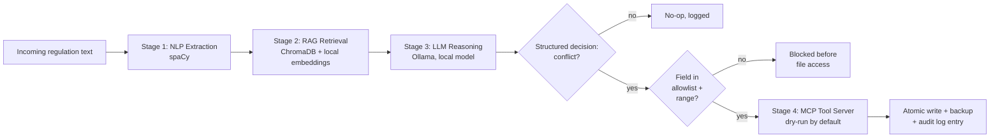

# Sentinel-Mesh


A local-first compliance agent: it reads incoming regulatory text, checks it against a company's internal policy using retrieval-augmented generation, reasons about conflicts with a **locally hosted LLM (Ollama — nothing leaves the machine)**, and — only when it detects a genuine, allowlisted conflict — patches the policy file through a properly gated **MCP tool server**.


## Why this exists

Compliance teams manually re-read every new regulation and cross-check it against internal configuration. That doesn't scale. Sentinel-Mesh is a proof-of-concept for automating the *detection* step end-to-end, while keeping a human-controllable, audited, allowlisted boundary around the one step that actually matters: **writing to a production config file.**

## Architecture



Every stage's output is a typed object consumed by the next stage — nothing is extracted and discarded.

## What changed from the first draft (and why it matters)

This started as a working demo with a critical flaw: the LLM's reasoning was generated and printed, but **the file patch executed unconditionally regardless of what the model concluded** — with hardcoded before/after values. That's the difference between an agent and a script with an LLM-shaped decoration. Fixing that was the core of this rewrite:

| Problem | Fix |
|---|---|
| Patch ran unconditionally, ignoring the model's output | LLM is prompted for strict structured JSON (`ComplianceDecision`); the patch tool is only ever called when `conflict: true` |
| Hardcoded `old_value`/`new_value` | Values are derived from the model's own parsed decision |
| Any string could be patched into the file | `config.ALLOWED_POLICY_FIELDS` allowlists specific fields **and** numeric ranges; anything else is rejected before the file is touched |
| No dry-run / approval gate | `dry_run=True` by default everywhere; the CLI requires an explicit `--apply` flag to write |
| Two duplicate, disconnected tool implementations (a LangChain `@tool` and a separate unused MCP server) | One implementation (`mcp_server.py`); the agent calls it as a **real MCP client** over stdio |
| NLP extraction results were computed and never used | Fed into the RAG query as a retrieval hint |
| `print()`-only observability | Append-only JSON-lines audit log (`data/audit_log.jsonl`) with content hashes and backup paths for every attempted and applied change |
| No error handling around the LLM call | Wrapped with a clear, actionable error if Ollama isn't running or the model isn't pulled |
| Writes weren't atomic or reversible | Temp-file-then-`os.replace()` writes, plus a timestamped backup before every applied patch |

## Project structure

```
sentinel-mesh/
├── sentinel_mesh/
│   ├── config.py          # allowlisted fields, model names, paths
│   ├── nlp_extractor.py   # Stage 1: spaCy entity extraction
│   ├── rag_store.py       # Stage 2: ChromaDB vector store wrapper
│   ├── agent.py           # Stage 3 + orchestration: LLM reasoning that gates action
│   ├── mcp_server.py       # Stage 4: MCP tool server (the only code allowed to write)
│   └── audit.py           # append-only JSON-lines audit trail
├── scripts/
│   ├── index_policy.py    # one-time: embed the policy file into the vector store
│   └── run_agent.py       # CLI entry point (--law-text / --law-file, --apply)
├── tests/                 # pytest suite — proves the gating logic actually gates
├── data/
│   └── internal_policy.txt
└── requirements.txt
```

## Setup

### Option A — Docker (recommended)

Everything — Ollama, model download, spaCy model, the app — is wired up in one compose file. No local Python environment or manually-run Ollama service needed.

```bash
docker compose up --build
```

The first run pulls `llama3.2:1b` into a named volume (`ollama_models`) and indexes the policy file — this takes a few minutes the first time, seconds after. The default `app` command runs one dry-run example. To run your own:

```bash
docker compose run --rm app --law-text "New law text..." --apply
```

`data/` is bind-mounted into the container, so the Chroma store, audit log, and any backups persist on your host between runs.

### Option B — Local Python environment

```bash
python -m venv .venv && source .venv/bin/activate
pip install -r requirements.txt
python -m spacy download en_core_web_sm

# Ollama must be running locally with the model pulled:
ollama pull llama3.2:1b
```

## Usage

```bash
# 1. Index the internal policy into the vector store (run once, or after editing it)
python scripts/index_policy.py

# 2. Run the agent — safe by default (dry run, no file write)
python scripts/run_agent.py --law-text \
  "Financial databases are prohibited from storing transaction trail logs beyond 30 days."

# 3. Only once you're satisfied with the dry-run output, actually apply the patch
python scripts/run_agent.py --law-text "..." --apply
```

(Swap `python scripts/...` for `docker compose run --rm app ...` / `docker compose run --rm index` if using Docker.)

## Testing

```bash
pytest tests/ -v
```

The test suite specifically targets the failure modes above: it asserts the patch tool is **not** called when the model reports no conflict, **is** called with the model's own derived values when it does, and that out-of-allowlist or out-of-range patches are rejected before any file access happens.

## Security notes

- The agent never writes based on raw model text — only a parsed, schema-validated `ComplianceDecision`.
- Every patch target is checked against a hardcoded allowlist of fields and numeric ranges (`config.ALLOWED_POLICY_FIELDS`). A prompt-injected or hallucinated field/value is rejected before the file is even opened.
- All reasoning runs through a **locally hosted Ollama model** — no regulation text, policy content, or reasoning is sent to an external API.
- All writes are atomic and backed up; every decision (applied, blocked, or rejected) is recorded to an append-only audit log with content hashes.
- `dry_run=True` is the default at every layer; an explicit `--apply` flag is required to write.

## Known limitations / honest scope

This is a proof-of-concept, not a production compliance system. In particular: the allowlist covers two demo fields and would need to be extended per real policy schema; there's no authentication on the MCP server (it's spawned as a local stdio subprocess, not exposed over a network transport); and a 1B-parameter local model is a reasoning bottleneck — swapping in a larger local or hosted model would improve conflict-detection accuracy at the cost of the fully-local guarantee.

## License

MIT
